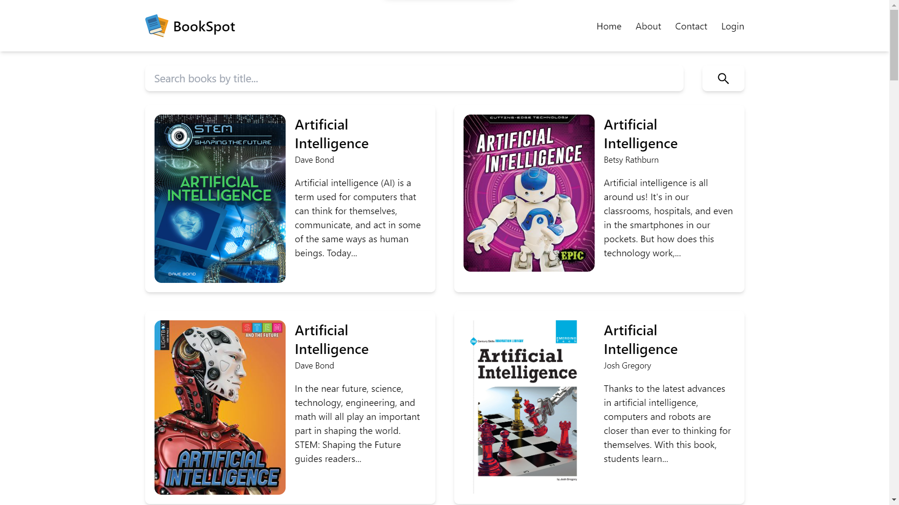

#  BookSpot

[BookSpot](https://bookspot-delta.vercel.app/) is a web app that allows you to find your favorite books online. It is created using React JS, Tailwind CSS and Vite.

[](https://bookspot-delta.vercel.app/)

## Steps to run the project locally

1. Clone the project locally.

   ```bash
   git clone https://github.com/astr0n0mer/bookspot.git
   ```

1. Install npm packages. Make sure you are in the project root directory.

   ```bash
   npm install
   ```

1. Run the development server.

   ```bash
   npm run dev
   ```

1. Navigate to [localhost:5173](http://localhost:5173) in your browser to see the app running.
